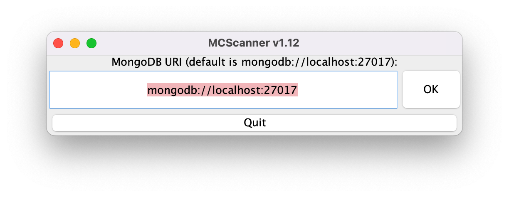

# Changes
All notable changes to this project will be documented in `CHANGELOG.md`.
## Added
* A menu that allows for configuring the MongoDB URI.

## Modified
* Fixed an IllegalStateException (`IllegalStateException: state should be: open`) stopping servers from being saved to the database.

## Removed
* Removed a few unnecessary comments and debug outputs.