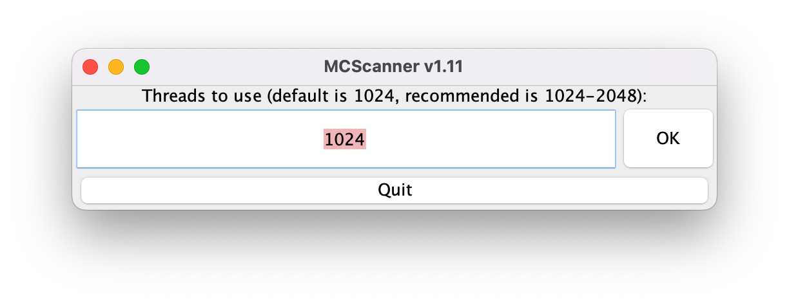

# Changes
All notable changes to this project will be documented in `CHANGELOG.md`.
## Added
* You can now configure how many threads you use upon starting MCScanner.

## Modified
* Updated `README.md`
  * Includes link to the `CHANGELOG.md` file.
  * Includes notice that says macOS users can just double-click on the `.jar` file.
  * Updated the requirements.

## Removed
Nothing has been removed.